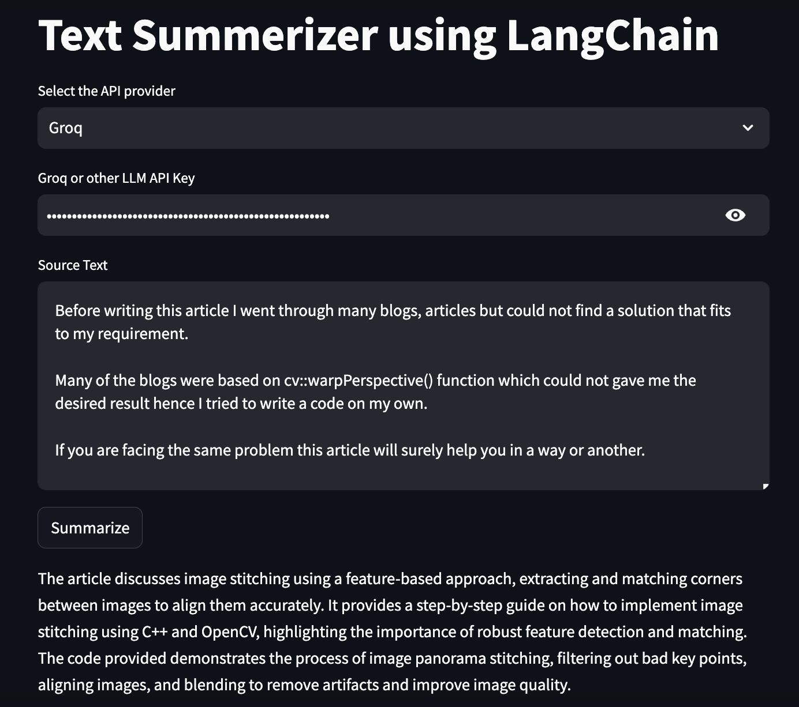

## Summarize It: Your Go-To Tool for Quick Text Summaries
### Note: This application was developed using Python 3.8

This repository features a Streamlit application designed for effortless text summarization, powered by two leading Large Language Model (LLM) providers:
1. Groq
2. OpenAI

### Getting Started

To use this application, you will need to create accounts and generate API keys from both Groq and OpenAI:

- Visit the [Groq](https://groq.com/) website, create a new account (if you haven't already), and generate an API key.
- Similarly, visit [OpenAI](https://platform.openai.com/docs/overview) to create an account and generate an API key.

After generating the API keys, store them securely on your machine, as you will need them to run the Streamlit application.

### App URL

You can access the application at: [https://llmportfolio.streamlit.app/](https://llmportfolio.streamlit.app/)

### Application Snapshot

Below is a snapshot of the application:

