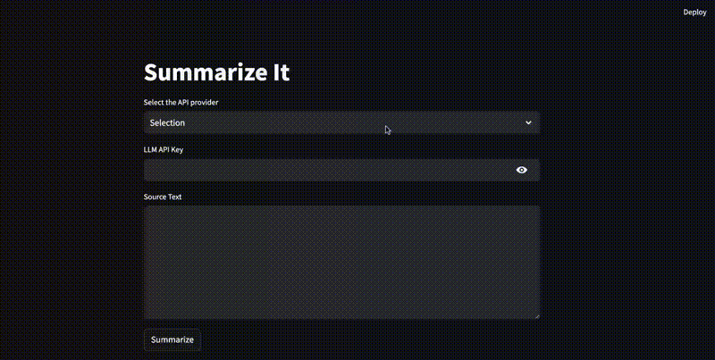

# 📝 Summarize It: Your Go-To Tool for Quick Text Summaries

**Note**: This application was developed using Python 3.8.

**Summarize It** is a user-friendly, Streamlit-based web application designed to effortlessly summarize articles. Powered by two powerful Large Language Model (LLM) providers—Groq and OpenAI—it simplifies the process of content summarization. The project transitions from a command-line interface (CLI) to an intuitive graphical UI, making it easier for users to quickly obtain summaries for any text they input.

## 🛠 Getting Started

To use this application, you need to create accounts and generate API keys from both Groq and OpenAI:

1. **Groq**: 
   - Visit the [Groq website](https://www.groq.com/), create a new account (if you haven’t already), and generate an API key.
   
2. **OpenAI**: 
   - Similarly, visit the [OpenAI website](https://platform.openai.com/docs/overview), create an account, and generate an API key.

After generating the API keys, store them securely on your machine. You'll need them to run the Streamlit application.

## 🌐 App URL

You can access the live application here:  
[Summarize It on Streamlit](https://llmportfolio.streamlit.app/)

## 🖼 Application Snapshot

Below is a snapshot of the **Summarize It** web application in action:



## 🚀 Running the App Locally

To run the application locally, follow these steps:

1. Clone this repository:
   ```bash
   git clone https://github.com/PavanHebli/Streamlit_Summerization.git
   ```
   
2. Navigate to the project directory:
   ```bash
   cd Streamlit_Summerization
   ```

3. Install the required dependencies:
   ```bash
   pip install -r requirements.txt
   ```

4. Run the app:
   ```bash
   streamlit run streamlit_app.py
   ```

5. Open the app in your browser by going to the provided localhost link.

## 📄 Features

- **Text Summarization**: Paste any article or content into the input box, and get a concise summary.
- **User-Friendly Interface**: Easy-to-use Streamlit app with a graphical UI.
- **Powered by LLMs**: Utilizes Groq and OpenAI for state-of-the-art text summarization.

## 🔑 API Keys

To enable the summarization functionality, you'll need to provide your **Groq** and **OpenAI** API keys in the input fields of the app UI.

## 👨‍💻 Contributing

If you'd like to contribute to this project, feel free to fork the repository, make your changes, and submit a pull request. Contributions are always welcome!

---

Thank you for checking out **Summarize It**—your go-to tool for quick text summaries!